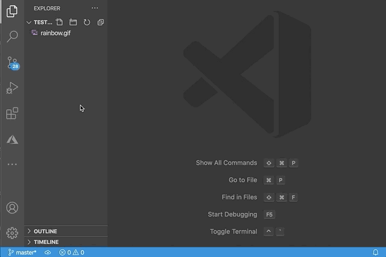
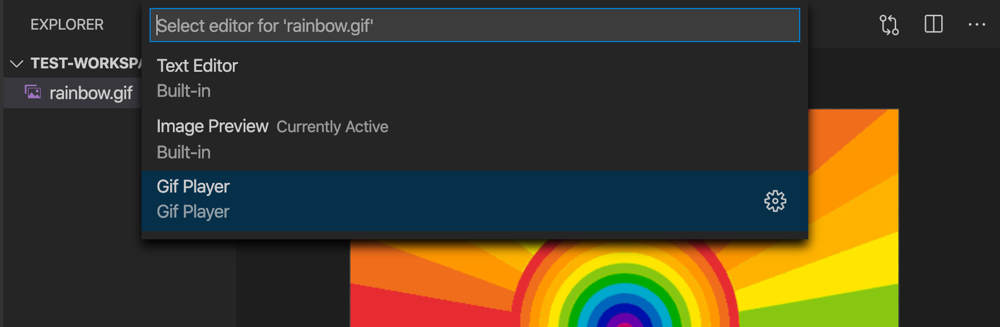

# Gif Player

Adds a play/pause button and a scrubber for controlling gif playback



## Features

- Adds play and pause buttons for controlling gif playback.
- Adds a timeline so you can scrub through gifs frame by frame.
- Configure `gifPlayer.autoPlay` to disable automatic playback of gifs.

## Configuration

- `gifPlayer.autoPlay` — Should gifs be automatically played when you open them? Defaults to true.

## Commands

- `gifPlayer.togglePlay` — Toggles if the gif is playing or pauses. Defaults keybinding: <kbd>space</kbd>

- `gifPlayer.nextFrame` — Goes to the next frame in the gif. Defaults keybinding: <kbd>right</kbd>

- `gifPlayer.previousFrame` — Goes to the previous frame in the gif. Defaults keybinding: <kbd>left</kbd>

Note that these keybindings are only active when you are focused on the Gif Player editor.

## Disabling Gif Player as the default editor

By default, the Gif Player editor is used for any gif you open. You can disable this using the `workbench.editorAssociations` setting. For example, this setting will use make VS Code use its standard image preview for when you open a gif:

```json
"workbench.editorAssociations": [
    {
        "viewType": "imagePreview.previewEditor",
        "filenamePattern": "*.gif"
    }
]
```

Then you can use the `View: Reopen Editor With` command to switch open individual gifs using Gif Player.

